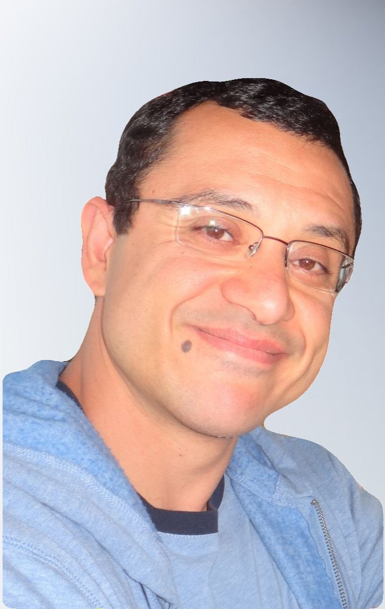

# Suat Gumussoy 

## Bio 

<table style="width: 100%">
    <colgroup>
       <col span="1" style="width: 20%;">
       <col span="1" style="width: 80%;">
    </colgroup>  
<tr>
  <td>
     
  </td>
  
  <td>

Dr. Gumussoy is a senior key expert on Closed-Loop AI at <a href="https://www.siemens.com/us/en/company/about/siemens-in-the-usa/new-jersey.html">Siemens Technology</a>. His research interests are <em>digital twin modeling, AI-driven control and design and their applications to control of power systems, smart manufacturing, and edge platforms.</em>

He is a Senior Member of IEEE since 2020 and a member of <a href="https://tc.ifac-control.org/2/2">IFAC Technical Committee on Linear Control Systems</a> since 2022. He served as an Associate Editor in <a href="http://ieeecss.org/publication/transactions-control-systems-technology">IEEE Transactions on Control Systems Technology</a> (2018-2022) and <a href="http://ieeecss.org/conferences/conference-editorial-board">IEEE Conference Editorial Board</a> (2018-2022).
</td>
</tr>
</table>

## Software 

**@Siemens:** Jointly architected a reinforcement learning toolbox, SCS-Reinforce, inside [Simcenter Studio](https://www.plm.automation.siemens.com/global/en/products/simcenter/simcenter-studio.html) with Siemens DI SW. Working together for the next cool features for our customers. Implemented new algorithms for tuning and calibration of power systems.

**@MathWorks:** Key contributions to [Reinforcement Learning Toolbox](https://www.mathworks.com/products/reinforcement-learning.html), [Robust Control Toolbox](https://www.mathworks.com/products/robust.html), [System Identification Toolbox](https://www.mathworks.com/products/sysid.html) and [Control System Toolbox](https://www.mathworks.com/products/control.html). Some highlights:
<ul>
  <li><b>Toolbox:</b> Lead engineer and architect in <a href="https://www.mathworks.com/products/reinforcement-learning.html">Reinforcement Learning Toolbox</a> including software architecture design, algorithm implementation, and team supervision.</li>
  <li><b>Algorithms:</b> Designed and implemented essential algorithms for MATLAB.</li>
    <ul>    
      <li>Designed more accurate <a href="https://www.mathworks.com/help/control/ref/dynamicsystem.c2d.html">continuous to discrete conversion algorithm</a> in c2d, least squares option.</li>
      <li>Authored faster and more accurate <a href="https://www.mathworks.com/help/ident/ref/tfest.html">transfer function estimation algorithm</a> from frequency-domain data in tfest.</li>
      <li>Implemented the <a href="https://www.mathworks.com/help/control/ref/dynamicsystem.balred.html">limited balanced truncation algorithm</a> to reduce model according to energies within time- and frequency-domain intervals.</li>
    </ul>
  <li><b>App Tools:</b> Authored the <a href="http://www.mathworks.com/help/control/ref/modelreducer-app.html">Model Reducer</a> for model reduction (<a href="http://www.mathworks.com/videos/model-order-reduction-with-the-model-reducer-app-118008.html">example</a>) and <a href="http://www.mathworks.com/help/slcontrol/tuning-with-control-system-tuner.html">Control System Tuner</a> for fixed-order distributed controller design (<a href="https://www.youtube.com/watch?v=stIS32tsbPI">example 1</a>, <a href="http://blogs.mathworks.com/seth/2014/04/03/control-system-tuning-without-guess-or-stress/">example 2</a>).</li>
</ul>

**@University of Leuven:** Designed and implemented a MATLAB toolbox for [analysis and control for time-delay systems](http://twr.cs.kuleuven.be/research/software/delay-control/index.html). The toolbox includes numerical algorithms for [H-infinity norm](http://twr.cs.kuleuven.be/research/software/delay-control/hinf/) and [pseudospectral abscissa](http://twr.cs.kuleuven.be/research/software/delay-control/psa/) computations and [H-infinity controller design](http://twr.cs.kuleuven.be/research/software/delay-control/hinfopt/) using nonsmooth, nonconvex optimization methods.

**@New York University, Courant Institute of Mathematical Sciences:** Contributed to the [MATLAB toolbox for fixed-order controller design](http://www.cs.nyu.edu/overton/software/hifoo/) (HIFOO). This toolbox solves several key control problems including fixed-order (strong/simultaneous) stabilization, H-infinity & H-2 optimization for mixed problems and multiple plants.

## Publications 

### Patents
 **[P9]** **S. Gumussoy**, J. Vanhuyse, M. Nicolai, S. Evmorfos, Fast policy training across multiple architectures using reinforcement learning for generative engineering. International Patent Application, 2024.

 **[P8]** X. Wu, M. K. Erdal, **S. Gumussoy**, U. Muenz, [Online calibration of power system model using time series measurement data](https://patents.google.com/patent/WO2024063819A1/en). International Patent Application, WO2024063819A1, 2024.

 **[P7]** **S. Gumussoy**, [Controller with on-demand nonlinearity](https://patents.google.com/patent/WO2024043933A1/en). International Patent Application, WO2024043933A1, 2024.

 **[P6]** Y. Wang, U. Muenz, **S. Gumussoy**, [Multi-asset placement and sizing for robust operation of distribution systems](https://patents.google.com/patent/WO2023027721A1/en). International Patent Application, WO2023027721A1, 2023.

 **[P5]** X. Wu, U. Muenz, **S. Gumussoy**, [Determining location and sizing of a new power unit within a current system architecture of a power system or a grid](https://patents.google.com/patent/WO2023033783A1/en). International Patent Application, WO2023033783A1, 2023.

 **[P4]** D. Hartmann, A. Pandey, **S. Gumussoy**, U. Muenz, [Explicit rule-based control of complex dynamical systems](https://patents.google.com/patent/WO2023022712A1/en). International Patent Application, WO2023022712A1, 2023.

 **[P3]** X. Wu, U. Muenz, **S. Gumussoy**, R. Ganjavi, [Inverter-based resource (IBR) optimized fault-level adjustment based on fault location](https://patents.google.com/patent/WO2023027986A1/en). International Patent Application, WO2023027986A1, 2023.

 **[P2]** **S. Gumussoy**, X. Wu, U. Muenz, [Power system model calibration using measurement data](https://patents.google.com/patent/WO2022231648A1/en). International Patent Application, WO2022231648A1, 2022.

<a name="P1"> **[P1]** **S. Gumussoy**, P. J. Mosterman, A. Ozdemir, </a>[Discretization of a model of a system or a portion of the model using system inputs and outputs](https://patents.google.com/patent/US20190026404A1/en). U.S. Patent, US20190026404A1, 2020.

### Journal Papers

 **[J23]** J. Vanhuyse, C. Bertheaume, **S. Gumussoy** and M. Nicolai, Conceptual closed-loop design of automative cooling systems leveraging Reinforcement Learning. Accepted to Forschung im Ingenieurwesen, Springer, 2025.

 **[J22]** N. Junnarkar, E. Jensen, X. Wu, **S. Gumussoy** and M. Arcak, [Grouping of N − 1 Contingencies for Controller Synthesis: A Study for Power Line Failures](https://doi.org/10.1109/TPWRS.2024.3393866). IEEE Transactions on Power Systems, vol. 40, no. 1, pp. 585-596, 2025. 

 **[J21]** E. Jensen, N. Junnarkar, M. Arcak, X. Wu and **S. Gumussoy**, [Certifying Stability and Performance of Uncertain Differential-Algebraic Systems: A Dissipativity Framework](https://doi.org/10.1109/TCNS.2024.3510585). IEEE Transactions on Control of Network Systems, 2024. 

 **[J20]** T. Basaklar, A. A. Goksoy, A. Krishnakumar, **S. Gumussoy**, U. Y. Ogras, [DTRL: Decision Tree-based Multi-Objective Reinforcement Learning for Runtime Task Scheduling in Domain-Specific System-on-Chips](https://dl.acm.org/doi/abs/10.1145/3609108). ACM Transactions on Embedded Computing Systems, no. 113, pp. 1–22, 2023.

 **[J19]** S. An, G. Bhat, **S. Gumussoy** and U. Y. Ogras, [Transfer Learning for Human Activity Recognition using Representational Analysis of Neural Networks](https://doi.org/10.1145/3563948). ACM Transactions on Computing for Healthcare, vol. 4, no. 5, pp. 1-21, 2023. 

 **[J18]** N. Xue, X. Wu, **S. Gumussoy**, U. Muenz, A. Mesanovic, Z. Dong, G. Bharati, S. Chakraborty, L. Cockcroft  and L. Dangelmaier, [Dynamic Security Optimization for N-1 Secure Operation of Hawai‘i Island System with 100% Inverter-Based Resources](https://doi.org/10.1109/TSG.2021.3135232). IEEE Transactions on Smart Grid, vol. 13, no. 5, pp. 4009-4021, September 2022.

 **[J17]** G. Bhat, **S. Gumussoy** and U. Y. Ogras, [Analysis and Control of Power-Temperature Dynamics in Heterogeneous Multiprocessors](https://doi.org/10.1109/TCST.2020.2974421). Transactions on Control Systems Technology, vol. 29, no. 1, pp. 329-341, 2020. 

 **[J16]** **S. Gumussoy** and M. Abu-Khalaf, [Analytic Solution of a Delay differential Equation Arising in Cost Functionals for System with Distributed Delays](https://doi.org/10.1109/TAC.2019.2921658). Transactions on Automatic Control, vol. 64, no. 11, pp. 4833-4840, 2019. 

 **[J15]** U. Gupta, M. Babu, R. Ayoub, M. Kishinevsky, F. Paterna, **S. Gumussoy** and U. Y. Ogras, [An Online Learning Methodology for Performance Modeling of Graphics Processors](https://doi.org/10.1109/TC.2018.2840710). IEEE Transactions on Computers, vol. 67, no. 12, pp. 1677-1691, 2018. 

 **[J14]** M. Abu-Khalaf and **S. Gumussoy**, [Comments on: “Lyapunov matrices for a class of time delays systems” by V. L. Kharitonov](https://arxiv.org/abs/1802.06831). Arxiv, 2018.

 **[J13]** G. Bhat, **S. Gumussoy** and U. Y. Ogras, [Power-Temperature Stability and Safety Analysis for Multiprocessor Systems](https://doi.org/10.1145/3126567). ACM Transactions on Embedded Computing Systems, vol. 16, no. 5, pp. 145:1-20, 2017. 

 **[J12]** **S. Gumussoy** and W. Michiels, [Computation of extremum singular values and the strong H-infinity norm of SISO time-delay systems](http://dx.doi.org/10.1016/j.automatica.2015.02.003). Automatica, vol. 54, pp. 266-271, 2015. 

 **[J11]** **S. Gumussoy** and W. Michiels, [Root-Locus for SISO Dead-Time Systems: A Continuation Based Approach](http://dx.doi.org/10.1016/j.automatica.2012.01.010). Automatica, vol. 48, no. 3, pp. 480-489, 2012. 

 **[J10]** T. D. Quoc, **S. Gumussoy**, W. Michiels and M. Diehl, [Combining Convex-Concave Decomposition and Linearization Approaches for Static Feedback Controller Design](http://dx.doi.org/10.1109/TAC.2011.2176154) (Regular Paper). IEEE Transactions on Automatic Control, vol. 57, no. 6, pp. 1377-1390, 2012. 

 **[J9]**  **S. Gumussoy**, [Coprime Inner/Outer Factorization of SISO Time-Delay Systems and FIR Structure of Their Optimal H-Infinity Controllers](http://dx.doi.org/10.1002/rnc.1740). International Journal of Robust and Nonlinear Control, vol. 22, no. 9, pp. 981-998, 2012. 

 **[J8]** **S. Gumussoy** and W. Michiels, [Fixed-Order H-infinity Control for Interconnected Systems using Delay Differential Algebraic Equations](http://dx.doi.org/10.1137/100816444). SIAM Journal on Control and Optimization, vol. 49, no. 2, pp. 2212-2238, 2011. 

 **[J7]** **S. Gumussoy**, [Relative Stability Analysis of Closed-Loop SISO Dead-Time Systems: Non-imaginary Axis Case](http://dx.doi.org/10.1177/0142331210385854). Transactions of the Institute of Measurement and Control, vol. 34, no. 4, pp. 411-421, 2011. 

 **[J6]** W. Michiels and **S. Gumussoy**, [Characterization and Computation of H-infinity Norms for Time-Delay Systems](https://doi.org/10.1137/090758751). SIAM Journal on Matrix Analysis and Applications, vol. 31, no. 4, pp. 2093-2115, 2010. 

 **[J5]** **S. Gumussoy** and W. Michiels, [A Predictor-Corrector Type Algorithm for the Pseudospectral Abscissa Computation of Time-Delay Systems](http://dx.doi.org/10.1016/j.automatica.2010.01.032) (Regular Paper). Automatica, vol. 46, no. 4, pp. 657-664, 2010. 

 **[J4]** **S. Gumussoy** and H. Ozbay, [Sensitivity Minimization by Strongly Stabilizing Controllers for a Class of Unstable Time-Delay Systems](http://dx.doi.org/10.1109/TAC.2008.2008346). IEEE Transactions on Automatic Control, vol. 54, no. 3, pp. 590-595, 2009. 

 **[J3]** **S. Gumussoy** and H. Ozbay, [Stable H-infinity Controller Design for Time-Delay Systems](https://doi.org/10.1080/00207170701426977). International Journal of Control, vol. 81, no. 4, pp. 546-556, 2008. 

 **[J2]** **S. Gumussoy** and H. Ozbay, [Remarks on Strong Stabilization and Stable H-infinity Controller Design](http://dx.doi.org/10.1109/TAC.2005.860271). IEEE Transactions on Automatic Control, vol. 50, no. 12, pp. 2083-2087, 2005. 

 **[J1]** **S. Gumussoy** and H. Ozbay, [On the Mixed Sensitivity Minimization for Systems with Infinitely Many Unstable Modes](http://dx.doi.org/10.1016/j.sysconle.2004.04.007). Systems and Control Letters, vol. 53, no. 3-4, pp. 211-216, 2004. 

### Conference Proceedings and Abstracts

 **[C39]** S. Bhela, **S. Gumussoy**, D. J. Kelly, M. J. Reno, A. Banaie, and U. Muenz, Co-optimization of Inverter Controls and Line Protection Functions for Improved Protection Reliability and System Stability. IEEE Power & Energy Society General Meeting (PESGM), 2025.

 **[C38]** V. Reddy, **S. Gumussoy**, H. Eldardiry and A. Boker, Learning Emergence of Interaction Patterns across Independent RL Agents in Multi-Agent Environments. IEEE International Conference on Robotics and Automation (ICRA), 2025. 

 **[C37]** C. Bonnet, H. Ozbay, M. O. Yegin and **S. Gumussoy**, [Implementation of Stabilizing Controllers for Retarded Delay Systems](https://www.sciencedirect.com/science/article/pii/S2405896324020937/pdf?md5=7ed1866147e66c93614c5de51e70fa62&pid=1-s2.0-S2405896324020937-main.pdf). IFAC Workshop on Time Delay Systems, 2024.

 **[C36]** V. R. Baddam, **S. Gumussoy**, H. Eldardiry and A. Boker, Searching for Sparse Controllers with a Budget: A Bottom-Up Approach. IEEE American Control Conference, 2024. 

 **[C35]** T. Basaklar, **S. Gumussoy** and U. Y, Ogras, [PD-MORL: Preference-Driven Multi-Objective Reinforcement Learning Algorithm](https://openreview.net/forum?id=zS9sRyaPFlJ). NeurIPS Deep RL Workshop. 2022. 11th International Conference on Learning Representations (ICLR) Design, 2023. 

 **[C34]** T. Basaklar, Y. Tuncel, **S. Gumussoy** and U. Y, Ogras, [GEM-RL: Generalized Energy Management of Wearable Devices using Reinforcement Learning](https://doi.org/10.23919/DATE56975.2023.10137228). Design, Automation and Test in Europe (DATE), April 2023.

 **[C33]** K. Fetzer, J. Menu and **S. Gumussoy**, Rule Extraction for Black-box Algorithm Analysis and Implementation.  15th Simulation and Digital Twin Conference, Munich, Germany, 2022.

 **[C32]** **S. Gumussoy**, [SSD–Software for Systems with Delays: Reproducible Examples and Benchmarks on Model Reduction and H2 Norm Computation](https://doi.org/10.1016/j.ifacol.2022.11.367).  Joint IFAC Conference: SSSC-TDS-LPVS, Montreal, Canada, 2022. 

 **[C31]** N. Xue, X. Wu, **S. Gumussoy**, U. Muenz, A. Mesanovic, Z. Dong, G. Bharati, S. Chakraborty, L. Cockcroft  and L. Dangelmaier, [Dynamic Security Optimization for N-1 Secure Operation of Power Systems with 100% Non-Synchronous Generation: First experiences from Hawai'i Island](https://doi.org/10.1109/PESGM46819.2021.9638130). IEEE Power & Energy Society General Meeting, 2021.

 **[C30]** T. Basaklar, Y. Tuncel, S. Y. Narayana, **S. Gumussoy** and U. Y. Ogras, [Hypervector Design for Efficient Hyperdimensional Computing on Edge Devices](https://arxiv.org/abs/2103.06709). tinyML Research Symposium, 2021.

 **[C29]** G. Bhat, **S. Gumussoy** and U. Y. Ogras, [Power and Thermal Analysis of Commercial Mobile Platforms: Experiments and Case Studies](https://doi.org/10.23919/DATE.2019.8714831). Design, Automation & Test in Europe Conference & Exhibition (DATE), pp. 144-149, 2019. 

 **[C28]** **S. Gumussoy**, and H. Ozbay, [On Feedback Stabilization of Neutral Time Delay Systems with Infinitely Many Unstable Poles](https://doi.org/10.1016/j.ifacol.2018.07.209).  14th IFAC Workshop on Time Delay Systems, Budapest, Hungary, June 28-30, 2018.

 **[C27]** **S. Gumussoy**, A. A. Ozdemir, T. McKelvey, L. Ljung, M. Gibanica, and R. Singh, [Improving Linear State-Space Models with Additional Iterations](https://doi.org/10.1016/j.ifacol.2018.09.158).  18th IFAC Symposium on System Identification, Stockholm, Sweden, July 9-11, 2018. 

 **[C26]** G. Bhat, **S. Gumussoy** and U. Y. Ogras, [Power-Temperature Stability and Safety Analysis for Multiprocessor Systems](https://doi.org/10.1145/3126567). 54th Design Automation Conference, Austin, Texas, USA, June 18-22, 2017. [preprint](http://elab.engineering.asu.edu/wp-content/uploads/2017/08/BhatESWEEK2017.pdf)

 **[C25]** A. A. Ozdemir  and **S. Gumussoy**, [Transfer Function Estimation in System Identification Toolbox via Vector Fitting](https://doi.org/10.1016/j.ifacol.2017.08.1026). 20th IFAC World Congress, Toulouse, France, July 9-14, 2017. 

 **[C24]** U. Gupta, J. Campbell, U. Y. Ogras, R. Ayoub, M. Kishinevsky, F. Paterna and **S. Gumussoy**, [Adaptive Performance Prediction for Integrated GPUs](https://doi.org/10.1145/2966986.2966997). International Conference on Computer-Aided Design (ICCAD), Austin, USA, November 7-10, 2016. [preprint](https://elab.engineering.asu.edu/wp-content/uploads/2016/07/GuptaICCAD2016.pdf)

 **[C23]** **S. Gumussoy**, B. Eryilmaz and P. Gahinet, [Working with Time-Delay Systems in MATLAB](https://doi.org/10.3182/20120622-3-US-4021.00041).  10th IFAC Workshop on Time-Delay Systems, Boston, USA, June 22-24, 2012. 

 **[C22]** W. Michiels and **S. Gumussoy**, [Eigenvalue based Analysis and Controller Synthesis for Systems described by Delay Differential Algebraic Equations](https://doi.org/10.3182/20120622-3-US-4021.00015).  10th IFAC Workshop on Time-Delay Systems, Boston, USA, June 22-24, 2012. 

 **[C21]** **S. Gumussoy** and W. Michiels, [Direct Strong H-infinity Norm Computation for SISO Time-Delay Systems](/assets/coia2011A.pdf) (invited session).  3rd International Conference on Control and Optimization with Industrial Applications, Ankara, Turkey, August 22-24, 2011.

 **[C20]** D. Arzelier, G. Deaconu, **S. Gumussoy** and D. Henrion, [H2 for HIFOO](https://arxiv.org/abs/1010.1442) (invited session). 3rd International Conference on Control and Optimization with Industrial Applications, Ankara, Turkey, August 22-24, 2011. [abstract](/assets/coia2011B.pdf)

 **[C19]** **S. Gumussoy** and W. Michiels, [Fixed-order Strong H-infinity Control of Interconnected Systems with Time-Delays](https://doi.org/10.3182/20110828-6-IT-1002.02036) (minisymposium). 18th IFAC World Congress, Milano, Italy, August 28-September 2, 2011. 

 **[C18]** **S. Gumussoy** and W. Michiels, [On the Sensitivity of the H-infinity Norm of Interconnected Systems with Time-Delays](https://doi.org/10.3182/20110828-6-IT-1002.00834) (minisymposium). 18th IFAC World Congress, Milano, Italy, August 28-September 2, 2011. 

 **[C17]** **S. Gumussoy** and W. Michiels, [Continuation Based Computation of Root-Locus for SISO Dead-Time Systems](https://doi.org/10.3182/20100607-3-CZ-4010.00016). 9th IFAC Workshop on Time-Delay Systems, 2010. 

 **[C16]** **S. Gumussoy** and W. Michiels, [Computing H-infinity Norms of Time-Delay Systems](https://doi.org/10.1109/CDC.2009.5400668). 48th IEEE Conference on Decision and Control, pp. 263-268, 2009. 

 **[C15]** **S. Gumussoy** and W. Michiels, [Fixed-Order H-infinity Optimization of Time-Delay Systems](/assets/bfg2009.pdf). 14th Belgian-French-German Conference on Optimization, 2009. [slides](/assets/bfg2009_slides.pdf)

 **[C14]** **S. Gumussoy** and W. Michiels, [Computing the Pseudospectral Abscissa of Time-Delay Systems](https://doi.org/10.3182/20090901-3-RO-4009.00019). 8th IFAC Workshop on Time-Delay Systems, 2009. 

 **[C13]** **S. Gumussoy**, D. Henrion, M. Millstone and M. L. Overton, [Multiobjective robust control with HIFOO 2.0](https://doi.org/10.3182/20090616-3-IL-2002.00025). 6th IFAC Symposium on Robust Control Design, 2009. 

 **[C12]** **S. Gumussoy** and W. Michiels, [Computing H-infinity Norms of Time-Delay Systems](/assets/benelux2009.pdf). 28th Benelux Meeting on Systems and Control, 2009. [slides](/assets/benelux2009_slides.pdf)

 **[C11]** **S. Gumussoy**, M. Millstone and M. L. Overton, [H-infinity Strong Stabilization via HIFOO, a Package for Fixed-Order Controller Design](https://doi.org/10.1109/CDC.2008.4738750). 47th IEEE Conference on Decision and Control, pp. 4135-4140 , 2008. 

 **[C10]** **S. Gumussoy**, M. Millstone and M. L. Overton, [Design of Fixed-Order Controllers via Nonsmooth Optimization](/assets/op2008.pdf). SIAM Conference on Optimization, Boston, MA, 2008. [slides](/assets/SIAMOP08-HIFOO.pdf)

 **[C9]** **S. Gumussoy**, [On the Zeros of Quasi-Polynomials with Single-Delay](https://doi.org/10.1109/ACC.2008.4587334). American Control Conference, pp. 5282-5286, 2008. 

 **[C8]** **S. Gumussoy** and M. L. Overton, [Fixed-Order H-Infinity Controller Design via HIFOO, a Specialized Nonsmooth Optimization Package](https://doi.org/10.1109/ACC.2008.4586909). American Control Conference, pp. 2750-2754, 2008. 

 **[C7]** **S. Gumussoy** and H. Ozbay, [Sensitivity Minimization by Stable Controllers: An Interpolation Approach for Suboptimal Solutions](https://doi.org/10.1109/CDC.2007.4434901). 46th IEEE Conference on Decision and Control, pp. 6071-6076, 2007. 

 **[C6]** **S. Gumussoy** and H. Ozbay, [Sensitivity Minimization by Strongly Stabilizing Controllers for a Class of Unstable Time-Delay Systems](https://doi.org/10.1109/ICARCV.2006.345194). 9th International Conference on Control, Automation, Robotics and Vision, pp. 1-5, 2006. 

 **[C5]** H. Ozbay and **S. Gumussoy**, [Remarks on H-infinity Controller Design for SISO Plants with Time Delays](https://arxiv.org/abs/2003.01701). 5th IFAC Symposium on Robust Control Design, 2006.

 **[C4]** **S. Gumussoy** and H. Ozbay, [Remarks on Strong Stabilization and Stable H-infinity Controller Design](https://arxiv.org/abs/2003.01089v1). 43rd IEEE Conference on Decision and Control, vol. 3, pp. 2621-2624, 2004.

 **[C3]** **S. Gumussoy** and H. Ozbay, [On Stable H-infinity Controllers for Time Delay Systems](https://arxiv.org/abs/2003.01573). 16th International Symposium on Mathematical Theory of Network and Systems, 2004.

 **[C2]** M. Saglam, S. Ezercan, **S. Gumussoy** and H. Ozbay, [Controller Tuning for Active Queue Management using a Parameter Space Method](https://arxiv.org/abs/2003.01076). 16th International Symposium on Mathematical Theory of Network and Systems, 2004.

 **[C1]** **S. Gumussoy** and H. Ozbay, [Control of Systems with Infinitely Many Unstable Modes and Strong Stabilizing Controllers Achieving a Desired Sensitivity](https://arxiv.org/abs/2003.01003). 15th International Symposium on Mathematical Theory of Network and Systems, pp. 1-10, 2002.

### Book

 H. Ozbay, **S. Gumussoy**, K. Kashima and Y. Yamamoto, [Frequency Domain Techniques for H-Infinity Control of Distributed Parameter Systems](https://doi.org/10.1137/1.9781611975406). Advances in Design and Control, SIAM, 2018.

### Book Chapters

<a name="BC4"> **[BC4]** **S. Gumussoy** and W. Michiels, </a>[Tuning an H-Infinity Controller with a Given Order and a Structure for Interconnected Systems with Delays](http://dx.doi.org/10.1007/978-3-319-05576-3_7). Low-Complexity Controllers for Time-Delay Systems, Advances in Delays and Dynamics (edited volume), pp. 95-110, Springer, 2014. 

 **[BC3]** **S. Gumussoy** and P. Gahinet, [Computer Aided Control System Design for Time Delay Systems using MATLAB](http://dx.doi.org/10.1007/978-3-319-01695-5_19). Delay Systems, Advances in Delays and Dynamics (edited volume), pp. 257-270, Springer, 2013. 

 **[BC2]** W. Michiels and **S. Gumussoy**, [Eigenvalue based algorithms and software for the design of fixed-order stabilizing controllers for interconnected systems with time-delays](http://dx.doi.org/10.1007/978-3-319-01695-5_18). Delay Systems, Advances in Delays and Dynamics (edited volume), pp. 243-256, Springer, 2013. 

 **[BC1]** **S. Gumussoy** and W. Michiels, [Fixed-order H-infinity Optimization of Time-Delay Systems](https://doi.org/10.1007/978-3-642-12598-0_10). Recent Advances in Optimization and its Applications in Engineering (edited volume), pp. 103-112, Springer, 2010. 

### Others

 **[T1]** K. Fetzer and **S. Gumussoy**, Implementation of digital twin calibration and AI-driven control on Yahboom tank robot for Siemens' smart manufacturing use case. Future of Automation Tech Talk Series, Siemens Technology, Princeton, 2023.

 **[Thesis]** **S. Gumussoy**, [Optimal H-infinity Controller Design and Strong Stabilization for Time-Delay and MIMO Systems](http://rave.ohiolink.edu/etdc/view?acc_num=osu1092850391). Ph.D. Thesis, Ohio State University, Electrical Engineering, 2004.

 **[Webinar]** **S. Gumussoy**, [Time-Delay Systems: Analysis and Design with MATLAB and Simulink](http://www.mathworks.com/videos/time-delay-systems-analysis-and-design-with-matlab-and-simulink-81948.html). MathWorks, December 4, 2012.

 **[Blog]** P. Gahinet, **S. Gumussoy**, E. Korkut and M. Cuenant, [Control System Tuning without Guess or Stress](http://blogs.mathworks.com/seth/2014/04/03/control-system-tuning-without-guess-or-stress/). MathWorks, April 3, 2014.
